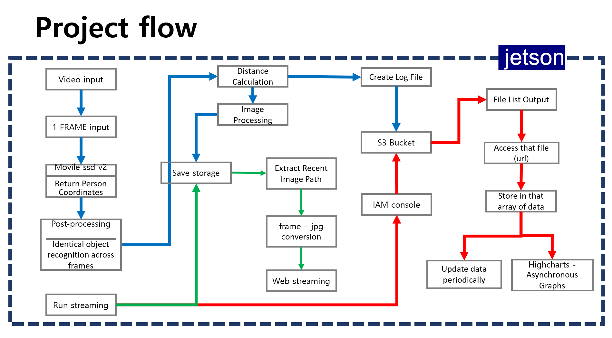
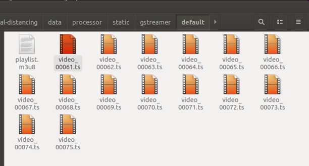
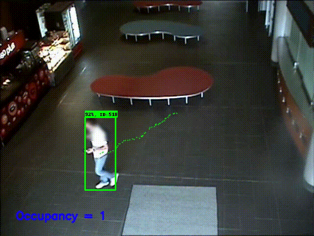

# smart-social-distancing-dev

- [Smart Social Distancing](#smart-social-distancing)
  - [Introduction](#Introduction)
  - [Getting Started](#getting-started)
    - [requirements](#requirements)
    - [docker start](#docker-start)
  - [Processor](#processor)
    - [docker run](#docker-run)
    - [run with video](#run-with-video)
    - [run with webcam](#run-with-webcam)
    - [aws s3 upload](#aws-s3-upload)
    - [bird's eye view(BEV)](#BEV)
    - [graph streaming](#graph-streaming)
  - [result](#result)

## Introduction


전 세계적으로 코토나 판데믹이 발생하면서 사회적 거리두기의 중요성도 증가하고 있다. 하지만 일부 공간을 제외하곤 사회적 거리두기를 지키기 힘들고 감시 인력도 부족한 상황이다. 따라서 우리는 좀 더 효과적으로 사회적 거리두기를 지킬 수 있는 방안을 생각하는 것이 필요하다. 다행히도 대부분의 공공기관에는 CCTV를 보유하고 있다. 그렇다면 우리는 이 어디에나 있는 cctv를 이용해서 사회적 거리두기를 모니터링할 수 있지 않을까? 소형 AI 컴퓨터 JETSON NANO를 사용하여 사회적 거리두기를 모니터링 할 수 있는 프로젝트를 소개하고자 한다.


이 프로젝트는 전적으로 [이곳을](https://github.com/neuralet/smart-social-distancing) 기반으로 한다


<div align="center">
  
</div>


이 프로젝트는 전체적으로 사회적 거리두기를 감지하는 영역과 이를 웹사이트로 모니터링 할 수 있는 영역으로 나뉜다.
프로젝트 전체 플로우는 아래 사진에 나타내었다.
<div align="center">
  
</div>


## Getting Started


### requirements


jetpack 4.3


aiofiles==0.5.0

boto3==1.14.59

fastapi==0.61.1

pandas==1.1.2

pyhumps==1.6.1

pytest==6.0.1

pytest-mock==3.5.1

freezegun==1.1.0


python-dotenv==0.15.0

requests==2.24.0

schedule==0.6.0

slackclient==2.8.2

uvicorn==0.11.8

yagmail==0.11.224

passlib==1.7.2

bcrypt==3.2.0

python-jose==3.2.0


필요한 라이브러리는 api/requirements.txt 파일에서도 확인할 수 있다.


### docker-start


이 프로젝트를 실행하기 위해선 jetosn nano에 docker이 설치되어 있어야 한다.
아직 docker를 설치하기 전이라면 아래 내용을 따라서 설치하길 바란다.


#### 설치 가능한 환경
Ubuntu Groovy 20.10

Ubuntu Focal 20.04 (LTS)

Ubuntu Bionic 18.04 (LTS) <<me!

Ubuntu Xenial 16.04 (LTS)


#### 이전에 설치된 도커 삭제


도커를 설치해도 이미지, 컨테이너는 보존될 수 있다.
```bash
$ sudo apt-get remove docker docker-engine docker.io containerd runc
```


#### 도커 설치


```bash
#우분투 패키지 업데이트
$ sudo apt-get update 

#필요한 패키지 설치
$ sudo apt-get install apt-transport-https ca-certificates curl gnupg-agent software-properties-common

#공식 GPG 키 추가(마지막의 –까지 포함하여 복사)
#리턴값 : ok
$ curl -fsSL https://download.docker.com/linux/ubuntu/gpg | apt-key add – 

#지문키 확인
$ apt-key fingerprint 0EBFCD88

#레포지토리 설치
#x86_64 / amd64
$ sudo add-apt-repository \
   "deb [arch=amd64] https://download.docker.com/linux/ubuntu \
   $(lsb_release -cs) \
   stable"
#armhf
$ sudo add-apt-repository \
   "deb [arch=armhf] https://download.docker.com/linux/ubuntu \
   $(lsb_release -cs) \
   stable"
#arm64
$ sudo add-apt-repository \
   "deb [arch=arm64] https://download.docker.com/linux/ubuntu \
   $(lsb_release -cs) \
   stable"
   
#도커 최신버전 설치
$ sudo apt-get install docker-ce docker-ce-cli containerd.io

#버전 선택하여 설치
$ sudo apt-get install docker-ce=<VERSION_STRING> docker-ce-cli=<VERSION_STRING> containerd.io

#설치할 수 있는 버전 목록 확인(<VERSION_STRING>에 적을거)
#(docker-ce 와 docker-ce-cli 버전이 동일해야함)
$ apt-cache madison docker-ce 
$ apt-cache madison docker-ce-cli

#도커 예제 hello world 실행
$ sudo docker run hello-world 

#실행하면 아래 사진처럼 나와야 함
```

<div align="center">
  
</div>

```bash
#도커 버전 확인
$ docker -v

#도커를 사용자 그룹에 추가(실행할 때 sudo 안붙여도 됨)
$ sudo usermod -aG docker $USER
$ sudo reboot
```


## processor


### docker-run

```bash
# 1) Download TensorRT engine file built with JetPack 4.3:
./download_jetson_nano_trt.sh

# 2) Build Docker image for Jetson Nano
docker build -f jetson-nano.Dockerfile -t "neuralet/smart-social-distancing:latest-jetson-nano" .

# 3) Run Docker container:
docker run -it --runtime nvidia --privileged -p HOST_PORT:8000 -v "$PWD":/repo -e TZ=`./timezone.sh` neuralet/smart-social-distancing:latest-jetson-nano
```


### run-with-video


config-jetson-nano.ini 파일에서 [source_0]의 VideoPath를 비디오경로로 수정하면 된다.


### run-with-webcam


jetson nano에 웹캠 연결 후 
```bash
$ v4l2-ctl --list-devices
```
위 명령어를 실행하여 생성된 리스트 중 웹캠 주소를 찾아 복사하여 config-jetson-nano.ini 파일의 [source_0]의 VIdeopath에 붙여넣는다.


### aws-s3-upload


프로젝트를 실행하면 생성되는 csv 파일을 s3 버킷에 업로드 할 수 있다.
s3에 업로드 하기 위해선 AWS_BUCKET_REGION, AWS_ACCESS_KEY_ID and AWS_SECRET_ACCESS_KEY를 제공해야 한다.
.env.example 파일을 다운받아 aws s3에서 생성한 버킷의 정보를 입력 후 aws.env 이름으로 저장한다


입력해야 할 정보는
aws bucket region
aws access key ID
aws secret access key
secret access key
4가지이다.


옵션을 선택한 뒤엔 config-jetson-nano.ini 파일의 [PeriodicTask_1] 카테고리에서 Enabled를 True로 설정하고 BackupInteval을 원하는 업로드시간(단위 : 분)으로 설정한 뒤에 BackupS3Bucket을 자신이 만든 버킷의 이름을 넣으면 된다.


### BEV 


자동차 블랙박스나 자율주행 등에 쓰이는 bird's eye view(BEV)는 원근적으로 찍은 사진을 수직 상공에서 보듯이 변환해주는 기법이다.
나는 내가 참고한 깃허브와 차별성을 위해 사람들 간에 거리를 구하는 방식으로 이 bird's eye view방식을 추가하였다.
또한 이 방법을 사용하면 사람들 간의 거리를 좀 더 정확하게 구할 수 있다.

<div align="center">
  (https://deepnote.com/@deepnote/A-social-distancing-detector-using-a-Tensorflow-object-detection-model-Python-and-OpenCV-KBcEvWejRjGyjy2YnxiP5Q)
</div>


적용방법은 config-jetson-nano.ini 파일에서 [source_0] 카테고리의 'DistMethod'를 'birdViewDistance'로 설정해주면 된다.
거리를 구하는 방법은 4가지가 있으며 그 중 하나를 선택할 수 있다.
CalibratedDistance
FourCornerPointsDistance
CenterPointsDistance
birdViewDistance


각 옵션에 대한 자세한 코드는 libs/source_post_processors/social_distance.py 파일에서 확인할 수 있다


### graph-streaming


s3에 업로드 된 csv 파일을 읽어들여와 그래프로 출력하고, 웹캠의 영상을 실시간으로 확인할 수 있는 라이브 스트리밍을 구축하였다.
도커 프로젝트를 실행한 뒤 다른 터미널을 열어서 smart-social-distancing 폴더로 이동한 후 아래 명령어를 실행시킨다.
```bash
$ pyhon3 server.py -i YOUR_IP_ADDERESS -p YOUR_PORT
```

jetson nano의 서버가 실행된 상태에서 컴퓨터가 휴대폰으로 jetson nano의 IP주소에 접근하면 라이브 스트리밍을 볼 수 있다.


만약 카메라를 여러대 사용할 경우 웹캠의 영상이 저장되는 위치가 달라질 수 있으니 server.py파일의 path 변수의 경로를 확인하길 바란다.


## result


프로젝트를 실행하면 사람을 인식하여 바운딩 박스를 친 영상이 ts파일로 저장되는 것을 볼 수 있다.

<div align="center">
  
</div>


비디오를 입력 영상으로 설정할 경우 아래와 같은 결과를 볼 수 있다.

<div align="center">
  
</div>

최종적으로 웹캠을 사용한 라이브 스트리밍과 그래프 시각화는 여기에서(링크설정) 볼 수 있다.

